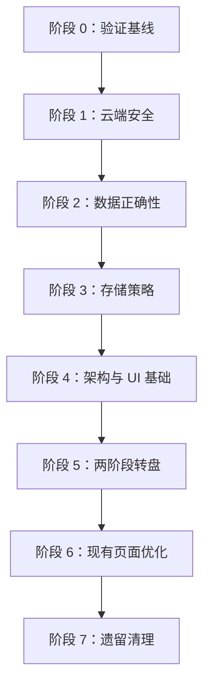

# 记事微清单：整体实施路线与 Codex 执行纲要

> 本文用于协调以下三份实施文档，作为后续交给 Codex 的总执行路线。它不替代三份专项文档；具体设计、风险说明和验收细节仍以专项文档为准。

> 实施状态：阶段 0～7 的核心代码任务已于 2026-08-29 完成并通过当前自动检查与用户逐项验证。本文继续作为架构边界和后续迭代约束，当前状态与剩余事项见 `docs/README.md`。

## 1. 关联文档

1. `wechatAPP-risk-and-ux-improvement-guide.md`
   - 代码、数据、工程风险及现有体验问题。
   - 包含风险编号、影响、建议方案、验收标准和验证方法。
2. `wechatAPP-meal-roulette-feature-design.md`
   - “今天吃什么”两阶段转盘的完整功能设计。
   - 包含流程、数据模型、随机规则、异常处理及验收场景。
3. `wechatAPP-architecture-and-ui-implementation-guide.md`
   - 原生微信小程序的架构演进和 UI 统一方案。
   - 包含目标分层、公共组件、设计令牌、页面调整和阶段计划。

## 2. 总体决策

- 保留原生微信小程序架构及 Glass-Easel，不迁移 Taro、uni-app 等跨端框架。
- 不一次性执行三份文档，也不进行全项目大规模重写。
- 架构文档负责确定工程方向，风险文档按优先级穿插，转盘文档作为第一个按新架构实现的完整业务功能。
- 每轮只完成一个边界清楚、可独立验证、可独立提交的任务。
- 安全和数据正确性优先于架构重构；架构基础优先于新增功能；新增功能稳定后再做全局 UI 优化和遗留清理。
- 不在同一提交中混合安全修复、数据迁移、架构重构、新功能和视觉调整。
- 所有改动必须先在微信开发者工具中编译验证；涉及设备差异、交互或动画时还要真机验证。

## 3. 推荐执行顺序

| 阶段 | 目标 | 主要依据 | 是否允许调整 UI |
|---|---|---|---|
| 0 | 建立可编译、可测试、可对比的基线 | 架构文档阶段 0、风险项 R-07/R-09 | 否 |
| 1 | 消除高风险云端问题 | 风险项 R-01、R-02、R-05、R-08 | 否 |
| 2 | 修复分页及长期数据正确性 | 风险项 R-03 | 否 |
| 3 | 确定本地与云端数据策略 | 风险项 R-04、R-06 | 否，必要提示除外 |
| 4 | 建立内部架构和 UI 基础 | 架构文档阶段 1～4 | 仅允许试点页面 |
| 5 | 实现两阶段转盘 | 转盘功能文档 | 是，仅限转盘及入口 |
| 6 | 优化现有重点页面 | 架构文档阶段 5、风险文档 UX 项 | 是 |
| 7 | 统一术语、配置并清理遗留 | 风险项 R-10～R-12 | 仅必要调整 |

依赖关系如下：



## 4. 阶段 0：建立开发与验证基线

### 4.1 目标

先证明现有版本可以正常编译和运行，并建立后续每轮改动都可重复执行的检查方法。

### 4.2 任务

- 检查 Git 工作区和现有分支，保留用户已有改动，不覆盖无关文件。
- 在不修改业务逻辑的前提下，用微信开发者工具完成一次基线编译。
- 固定经过验证的稳定微信基础库版本，不继续使用 `trial`。
- 增加最小的工程检查入口，包括 JavaScript 语法、JSON、页面四件套、页面注册及基础单元测试。
- 为不依赖 `wx.*` 的纯函数建立最小单元测试运行环境。
- 记录当前首页、菜谱、饮食清单、记录页等关键页面截图。
- 走通现有核心流程并记录结果：菜谱、今日饮食清单、采购、饮食记录、生活清单和完成记录。

### 4.3 禁止事项

- 不修改业务行为。
- 不重构目录。
- 不调整页面 UI。
- 不顺带修复后续阶段的问题。

### 4.4 完成标准

- 微信开发者工具编译通过，或明确列出可复现的既有错误。
- 稳定基础库版本已记录并验证。
- 项目检查命令可重复运行。
- 基线截图和核心流程结果有记录。
- 改动被拆分成可审查的小提交。

### 4.5 建议提交

```text
chore(tooling): 增加项目检查与测试基础
chore(config): 固定稳定小程序基础库版本
```

## 5. 阶段 1：高风险云端问题

### 5.1 执行顺序

1. R-01：限制或移除菜谱 `reinit` 操作，禁止普通用户清空并重建公共菜谱。
2. R-02：修复菜谱并发初始化，保证幂等性并避免重复数据。
3. R-05：为云函数增加输入类型、必填字段、范围及枚举校验。
4. R-08：统一云函数错误码、客户端提示和必要日志，避免泄露敏感内部信息。

### 5.2 执行约束

- 每个风险编号单独实现、单独验证、单独提交。
- 修改前先明确云函数调用方、权限边界和现有数据影响。
- 不同时进行目录重构或 UI 优化。
- 涉及破坏性管理操作时，默认关闭普通客户端入口，并在服务端进行授权校验。

### 5.3 完成标准

- 未授权用户无法执行管理操作。
- 并发初始化不会产生重复或中间状态。
- 非法参数得到稳定、可识别的业务错误。
- 正常业务流程保持兼容。

## 6. 阶段 2：分页和长期数据正确性

### 6.1 范围

单独执行风险项 R-03，优先保证数据完整，再考虑记录页外观。

### 6.2 任务

- 为饮食记录和需要长期增长的数据增加分页或按日期范围查询。
- 月历按自然月查询，不使用最多 100 条后在客户端截取的方式。
- 列表支持稳定排序和继续加载。
- 月度统计使用完整月份数据，避免与月历、列表结果不一致。
- 设计并验证空数据、恰好 100 条、超过 100 条和跨月数据场景。

### 6.3 禁止事项

- 不在本阶段重做记录页 UI。
- 不因分页改造顺手重命名数据库集合。
- 不一次性加载全部历史数据替代真正的分页或范围查询。

### 6.4 完成标准

- 超过 100 条后，列表、月历和统计仍完整且一致。
- 分页无重复、无遗漏，排序稳定。
- 查询范围和索引需求已说明。
- 原有少量数据场景保持正常。

## 7. 阶段 3：存储和同步策略

### 7.1 必须先做的产品决策

明确以下数据是否需要跨设备同步：

| 数据 | 推荐策略 |
|---|---|
| 公共菜谱 | 保持现有云端存储 |
| 饮食记录 | 保持云端存储，按用户隔离 |
| 堂食/外卖候选餐单 | 推荐按 OpenID 隔离后存云端 |
| 转盘当日来源选择 | 本地缓存；需要跨设备时再同步云端 |
| 收藏、库存、生活清单 | 制定逐步迁移云端的计划 |
| 临时 UI 状态 | 仅页面内或本机存储 |

### 7.2 若先实现本地 MVP

- 页面不得直接调用 `wx.getStorageSync/setStorageSync` 管理业务数据。
- 通过 repository 封装读取与写入。
- 数据结构必须包含 `schemaVersion`。
- 提供默认值、旧数据迁移、异常数据恢复和写入失败处理。
- 保持接口可替换，使以后迁移云端时不必重写页面和领域逻辑。

### 7.3 完成标准

- 每类数据的唯一事实来源清楚。
- 用户隔离、跨设备同步和本地缓存边界清楚。
- 转盘候选数据的存储方案已经确定。
- 本地数据有版本及迁移策略。

## 8. 阶段 4：架构与 UI 基础

本阶段按小步方式执行，不要求一次性迁移全部代码。

### 8.1 设计令牌与首页试点

- 建立全局颜色、字号、间距、圆角、阴影、点击区域和安全区变量。
- 提取 `app-card`、`loading-state`、`empty-state`、`error-state` 等基础组件。
- 先在首页试点，保持原业务行为和导航不变。
- 对比基线截图，确认没有非预期回归后再推广。

### 8.2 提取纯业务逻辑

优先把以下逻辑放入不依赖 `wx.*` 的 `domain` 层：

- 转盘候选过滤。
- 抽签袋及防连续重复算法。
- 两阶段转盘状态机。
- 库存到期计算。
- 采购缺口计算。

每个纯业务模块都应有单元测试，覆盖边界值和异常输入。

### 8.3 建立 repository 与 service

建议迁移顺序：

1. 菜谱。
2. 转盘候选数据。
3. 今日饮食清单。
4. 饮食记录。

职责边界：

- `pages`：页面状态、事件响应和导航。
- `components`：可复用表现及有限交互。
- `domain`：无平台依赖的纯业务规则。
- `repositories`：云数据库与本地存储访问。
- `services`：协调一次完整业务流程。

不要为了达到目标目录结构而一次性移动全部 `utils`；只迁移当前任务真正涉及的模块。

### 8.4 TDesign 试点

当前决定：暂不引入 TDesign。现有自建设计令牌和公共组件已覆盖当前需求，也避免增加主包体积与混用两套视觉体系。将来只有出现现有组件难以稳定覆盖的通用交互时，才按以下流程重新评估：

- 依赖引入单独提交。
- 先在一个低风险页面试用 Checkbox、Dialog 或 Loading。
- 验证 Glass-Easel 兼容性、稳定基础库、NPM 构建、包体积和真机显示。
- 只按需注册组件。
- 首页场景卡片、菜谱卡片、转盘和结果卡等产品特色组件继续自定义。
- 若试点不满足要求，完整撤销，不保留半套依赖。

### 8.5 完成标准

- 首页试点在功能、视觉和触控上通过验证。
- 新的领域逻辑不依赖微信运行环境并有测试。
- 页面不直接承担新增模块的存储细节。
- TDesign 是否采用已有明确结论。

## 9. 阶段 5：实现两阶段转盘

完整执行 `wechatAPP-meal-roulette-feature-design.md`，但仍按以下内部顺序拆分：

1. 定义堂食、外卖、自己做的候选数据模型。
2. 建立候选 repository。
3. 实现候选过滤、抽签袋、防重复算法和状态机，并补单元测试。
4. 实现堂食与外卖候选餐单管理。
5. 实现可复用转盘组件。
6. 实现两阶段转盘页面。
7. 在首页增加入口。
8. 将“自己做”结果衔接到菜谱详情和今日饮食清单。
9. 完成开发者工具与真机验收。

### 9.1 第一阶段核心规则

- 堂食、外卖、自己做是三个同级多选项。
- 只有用户勾选的来源才能进入第一阶段转盘。
- 至少选择一项才能开始。
- 只选择一项时，可以直接确认来源并进入第二阶段。
- 已选中但没有有效餐单的来源，在开始前排除并给出明确提示。
- 三个来源均不得被硬编码为必选项。

### 9.2 第二阶段核心规则

- 只从第一阶段确定的来源对应候选池抽取具体餐单。
- “自己做”复用现有菜谱。
- “堂食”和“外卖”使用用户可维护的候选餐单。
- 采用抽签袋机制减少连续重复；候选耗尽后再重新洗牌。
- 用户选择“就这个”后才记录最终决定。
- 提供“再转一次”和“直接告诉我”。

### 9.3 首版范围限制

- 不接地图、定位、商家搜索或外卖平台。
- 不新增底部导航入口。
- 不把转盘做成营销抽奖风格。
- 不在实现转盘时同步重做所有现有页面。

### 9.4 完成标准

- 所有来源选择组合及空候选场景均有测试。
- 未选择的来源绝不会进入转盘。
- 防重复规则可验证且无死循环。
- 页面流程、动画、快速模式和异常状态都可用。
- “自己做”与现有菜谱及饮食清单衔接正确。

## 10. 阶段 6：现有页面 UI 与体验优化

推荐按以下页面顺序执行，每个页面或紧密相关的一组页面单独提交：

1. 首页。
2. 今日饮食清单。
3. 记录页。
4. 菜谱与菜谱详情。
5. 生活清单与清单详情。
6. 采购清单与食材库存。
7. 本月回顾。

### 10.1 统一要求

- 使用既定设计令牌，不再新增近似但不同的颜色、间距和圆角。
- 核心功能图标使用统一图标体系，Emoji 仅作为装饰或空状态表达。
- 点击区域满足移动端触控要求，不能只扩大视觉图标而忽略实际热区。
- 统一 Loading、Empty、Error、Toast、Dialog 和重试体验。
- 正确处理全面屏安全区、长列表、长文本、空数据及网络异常。

### 10.2 记录页专项约束

- 默认以月历浏览日期。
- 点击日期后展示当天饮食和生活清单记录。
- 列表视图作为明确切换项。
- 批量删除只在管理模式出现。
- 月度统计保留在“本月回顾”，避免记录页继续堆叠职责。

## 11. 阶段 7：术语、配置和遗留清理

最后处理：

- R-10：统一 `cart/order/商品/结算` 等旧“点餐系统”术语。
- R-11：清理本地环境配置并完善仓库忽略规则。
- R-12：清理未注册的 `pages/logs`、未使用样式和无效代码。
- 替换核心入口中的 Emoji 图标。
- 评估并清理不再使用的价格、订单状态等字段。

### 11.1 注意事项

- 数据库集合或字段重命名属于数据迁移，必须先制定兼容、回滚和验证方案。
- 不要只修改界面文案而遗漏云函数、日志、测试和存储结构。
- 在确认新旧版本数据兼容前，不删除旧字段或集合。

## 12. 每轮 Codex 的统一执行协议

每次开始任务时，Codex 必须：

1. 阅读本文及三份专项文档。
2. 检查仓库中的 `AGENTS.md`、`CLAUDE.md`、README、项目规则文件和现有 Git 状态。
3. 只执行本轮明确授权的阶段、子阶段或风险编号。
4. 修改前列出将涉及的模块、预期文件及验证方案；若实际情况与文档冲突，先说明并停止扩大范围。
5. 保留用户现有未提交改动，不重置、不覆盖、不清理无关文件。
6. 先理解现有调用链和数据结构，再修改代码。
7. 采用最小兼容改动，避免无关格式化和机械重写。
8. 为新增纯业务逻辑补充单元测试。
9. 运行所有可执行的静态检查和测试。
10. 需要微信开发者工具或真机才能验证的内容必须明确列为待人工验证，不能声称已经通过。

每轮完成后，Codex 必须输出：

- 本轮范围和完成状态。
- 修改文件清单及每个文件的用途。
- 关键实现决策。
- 已运行的检查、测试和结果。
- 微信开发者工具及真机验收步骤。
- 未验证项、已知限制和后续风险。
- 建议的一个或多个 commit message。
- 下一轮最小任务建议，但不得自动开始执行。

## 13. 提交与回滚原则

- 一个提交只解决一个明确问题。
- 配置、测试基础、风险修复、数据迁移、重构、新功能和 UI 分开提交。
- 重构提交不得改变业务行为；业务修改不得夹带大范围重构。
- 数据迁移必须具备前置检查、幂等性、结果校验和回滚说明。
- 每个阶段完成后打可识别的 Git 标签或记录基线提交，便于回退。
- 若本轮验证不完整，不合并到下一阶段继续堆叠改动。

## 14. 可直接交给 Codex 的总提示词

```text
请先完整阅读以下四份文档：

1. wechatAPP-implementation-roadmap.md
2. wechatAPP-risk-and-ux-improvement-guide.md
3. wechatAPP-meal-roulette-feature-design.md
4. wechatAPP-architecture-and-ui-implementation-guide.md

它们分别是整体执行路线、风险与体验清单、两阶段转盘设计、架构与 UI 演进方案。

执行原则：

- 保留原生微信小程序和 Glass-Easel，不迁移跨端框架。
- 三份专项文档都作为上下文，但本轮只执行我明确指定的范围。
- 不顺手处理其他风险、重构、功能或 UI。
- 修改前检查 AGENTS.md、CLAUDE.md、README、项目规则文件及 Git 工作区。
- 保留现有未提交改动，不覆盖无关文件。
- 先理解现有调用链和数据结构，再做最小兼容修改。
- 新增纯业务逻辑必须脱离 wx.* 并补单元测试。
- 运行可执行的检查和测试；无法在当前环境验证的开发者工具或真机项目必须明确列出，不能假称通过。
- 每个独立问题单独提交，不混合安全修复、数据迁移、架构重构、新功能和视觉调整。

本轮执行范围：

【在这里填写一个阶段、一个子阶段或一个风险编号】

开始前先说明：

1. 你对本轮范围的理解；
2. 预计涉及的文件和模块；
3. 验证计划；
4. 发现哪些条件会导致你暂停并向我确认。

完成后请输出：

1. 修改文件清单；
2. 关键实现说明；
3. 检查和测试结果；
4. 微信开发者工具和真机验收步骤；
5. 未验证项与已知限制；
6. 建议 commit message；
7. 下一轮最小任务建议，但不要自动继续。
```

## 15. 分阶段提示词模板

### 15.1 首轮：阶段 0

```text
本轮只执行 wechatAPP-implementation-roadmap.md 的阶段 0：建立开发与验证基线。

不要修改业务逻辑，不要调整 UI，不要重构目录，也不要处理其他风险项。完成稳定基础库配置、最小检查与测试基础、基线验证记录。若当前环境不能调用微信开发者工具，请完成可执行部分，并给出准确的人工验证步骤，不要声称编译通过。
```

### 15.2 单个风险项

```text
本轮只处理风险文档中的 R-01。

不要同时处理 R-02 或其他风险，不要进行架构重构或 UI 调整。先定位全部调用方和权限边界，再给出最小安全修复。完成后提供未授权、已授权和正常业务场景的验证结果。
```

后续将 `R-01` 替换成当前风险编号，一次只处理一个。

### 15.3 架构子阶段

```text
本轮只执行整体路线阶段 4.2：提取转盘候选过滤、抽签袋和状态机的纯业务逻辑及单元测试。

暂不创建转盘页面，不修改现有页面 UI，不迁移无关 utils。domain 层不得依赖 wx.*。请保持接口适合后续 page → service → repository/domain 调用。
```

### 15.4 转盘功能

```text
本轮只执行转盘功能文档中的【填写一个子任务，例如：候选数据模型和 repository】。

不要一次完成整个转盘功能。遵守三个来源完全同级、只有勾选项进入第一阶段转盘的规则。不得接入地图、定位、商家搜索或外卖平台。
```

### 15.5 单页 UI 优化

```text
本轮只优化【填写页面名】的 UI 与体验。

复用现有设计令牌和公共组件，不改变业务逻辑、数据结构及导航行为。请提供改动前后截图对照、不同数据状态检查和真机验收清单。不要同时调整其他页面。
```

## 16. 推荐的实际启动方式

后续不要直接要求 Codex“执行全部文档”。按以下节奏推进：

1. 将四份指导文档放在 `docs/` 目录并提交。
2. 使用阶段 0 提示词建立基线。
3. 人工确认编译与主要流程正常后提交。
4. 按 R-01、R-02、R-05、R-08 顺序逐项修复。
5. 单独完成 R-03，并用超过 100 条数据验证。
6. 由产品负责人确认阶段 3 的存储策略。
7. 小步建立架构和 UI 基础。
8. 将转盘作为新架构的首个完整业务模块。
9. 转盘稳定后逐页优化现有 UI。
10. 最后执行术语和遗留清理。

最简流程：

```text
验证基线
→ 云端安全
→ 数据正确性
→ 存储决策
→ 架构与设计系统基础
→ 两阶段转盘
→ 现有页面优化
→ 遗留清理
```

## 17. 文档冲突处理

若四份文档之间出现描述差异，按以下优先级处理：

1. 用户在当前任务中的最新明确要求。
2. 本文的阶段边界和执行顺序。
3. 对应专项文档中的详细功能或验收规则。
4. 代码当前实际行为。

若专项文档与代码存在重大不一致，Codex 应先报告差异、影响和可选方案，不得自行扩大范围或假定产品决策。

---

本文只定义执行路线，不代表已经完成任何代码修改、开发者工具编译或真机验证。
