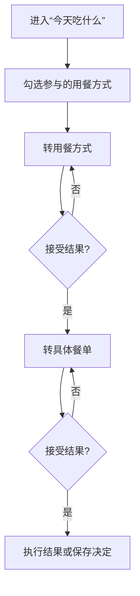

# “今天吃什么”两阶段转盘功能设计

> 项目：记事微清单微信小程序
> 用途：供后续在具备微信开发者工具、云开发和真机调试条件的开发环境中交给 Codex 实施。
> 基线：`wechatAPP-main(1).zip`，GitHub 快照提交 `5d983db3f70eba647b59cf2458f15bec2dcb2db0`。
> 本文为产品和实施设计，不代表代码已经修改或运行验证。

> 当前状态：MVP 已按本文完成，后续增强仍以第 6.3 节和第 7.3 节为候选范围；实际实现状态以 `docs/README.md` 和代码为准。

## 1. 功能目标

当用户“不知道吃什么”时，通过两个连续转盘帮助完成决策：

1. 先勾选今天允许参与的用餐方式：**堂食 / 外卖 / 自己做**。
2. 第一次转盘只在已勾选的用餐方式中决定来源。
3. 第二次从对应候选池中决定具体吃什么。

三个用餐方式地位相同，均为可选项。只有用户当前勾选的方式才能进入第一次转盘；至少需要选择一个。例如上班时可只选择堂食和外卖，在家时可以加入自己做。

该功能的价值不是提供复杂的餐饮推荐算法，而是降低日常选择成本，让用户用很少的操作得到一个可执行结果。

## 2. 产品命名

推荐功能名称：**今天吃什么**
推荐入口文案：**不知道吃什么？转一下**

界面中推荐使用“用餐方式”，避免使用稍显生硬的“饭食来源”。

| 内部值 | 用户文案 | 结果示例 |
| --- | --- | --- |
| `dine_in` | 堂食 | 去吃牛肉面 |
| `takeout` | 外卖 | 点黄焖鸡 |
| `cook` | 自己做 | 做番茄炒蛋 |

## 3. 核心流程



### 3.1 进入页面

页面首先展示：

- 标题：“今天吃什么”
- 用餐方式多选项：堂食、外卖、自己做
- 当前参与的用餐方式摘要
- 第一个转盘
- “开始转”按钮
- 候选餐单管理入口

用餐方式选择建议只记住当天状态，第二天重新确认，避免用户前一天在家选择“自己做”、第二天上班时忘记调整。页面必须始终清楚展示三个选项的选中状态。

### 3.2 第一次转盘：用餐方式

页面提供三个可勾选项：

- 堂食
- 外卖
- 自己做

进入第一次转盘的来源必须同时满足：

- 用户已经勾选该来源。
- 该来源存在至少一个有效候选餐单。

未勾选的来源完全不显示在转盘扇区中，抽中概率为 0。堂食、外卖和自己做使用相同规则，不对“自己做”做特殊处理。

如果用户没有选择任何来源，“开始转”按钮禁用，并提示“请至少选择一种用餐方式”。

### 3.3 用餐方式结果确认

转盘停止后显示结果卡片，例如：

> 今天选择：外卖

提供两个操作：

- **就这个**：进入第二阶段。
- **再转一次**：重新选择用餐方式。

如果用户只选择一个有效来源，可以直接确认该来源并进入第二阶段，不必播放没有意义的单项转盘动画。

### 3.4 第二次转盘：具体吃什么

第二个转盘根据第一次结果切换候选池：

| 第一次结果 | 第二次候选池 | 示例 |
| --- | --- | --- |
| 堂食 | 堂食候选餐单/地点 | 公司食堂、牛肉面、日料、火锅 |
| 外卖 | 外卖候选餐单/店铺 | 黄焖鸡、轻食、麻辣烫、汉堡 |
| 自己做 | 项目现有菜谱 | 红烧肉、番茄炒蛋、麻婆豆腐 |

“具体餐单”应允许填写菜名，也允许填写地点或店铺。用户真正需要的是一个可执行决定，因此不必强制所有候选项具有完全相同的数据结构。

### 3.5 最终结果

最终结果卡片根据来源显示不同动作：

#### 自己做

- 查看菜谱详情。
- 加入今日饮食清单。
- 再转一次。

#### 外卖

- 记录“今天决定吃这个”。
- 复制餐单名称，方便去外卖平台搜索。
- 再转一次。

#### 堂食

- 记录“今天决定吃这个”。
- 如果候选项有地点备注，显示地点。
- 再转一次。

MVP 不建议直接接入地图或外卖平台，避免授权、平台跳转和商户数据维护显著扩大功能范围。

## 4. 候选餐单从哪里来

这是实现该功能前必须明确的数据来源。

### 4.1 自己做

直接复用云数据库 `dishes` 中的现有菜谱，不重复维护一份菜名。

推荐筛选能力：

- 全部菜谱。
- 只从收藏中选。
- 按分类筛选：荤菜、素菜、海鲜、主食。
- 后续可增加“优先使用现有库存”的智能筛选。

MVP 建议使用“全部菜谱”，并允许用户在候选管理中临时排除不想吃的菜。

### 4.2 堂食与外卖

现有项目没有餐厅或外卖候选数据。推荐使用“默认候选 + 用户自定义”的方式：

- 首次使用提供少量通用餐类，确保打开即可转。
- 用户可新增、编辑、关闭或删除候选项。
- 用户自定义内容优先，不依赖外部平台数据。

建议默认候选仅作为起点，避免假装了解用户附近有哪些商家。

堂食默认示例：

- 公司/学校食堂
- 面食
- 快餐简餐
- 火锅
- 烧烤
- 日料

外卖默认示例：

- 米饭套餐
- 面食
- 麻辣烫
- 轻食
- 汉堡炸鸡
- 粥和小吃

默认项必须允许删除或关闭。

## 5. 推荐页面结构

建议新增页面：

```text
pages/meal-roulette/
  meal-roulette.js
  meal-roulette.json
  meal-roulette.wxml
  meal-roulette.wxss
```

如果候选管理内容较多，再增加：

```text
pages/meal-candidates/
  meal-candidates.js
  meal-candidates.json
  meal-candidates.wxml
  meal-candidates.wxss
```

### 5.1 首页入口

建议在首页“今天要做什么”标题上方或饮食清单卡片之前增加轻量入口卡片：

> 🎯 不知道吃什么？转一下  ›

不建议增加新的底部 tab。该功能属于饮食场景的快捷决策入口，不是与首页、清单、记录同级的信息架构。

也可以在菜谱页和空的今日清单页提供次要入口，但应复用同一个页面，避免多套逻辑。

### 5.2 页面状态

页面至少应覆盖以下状态：

1. 首次进入，等待转用餐方式。
2. 用餐方式转动中。
3. 用餐方式已选定，等待确认。
4. 具体餐单转动中。
5. 最终结果。
6. 当前来源没有候选项。
7. 菜谱或候选项加载失败。
8. 用户快速重复点击时的禁用状态。

建议使用明确的状态机，不要只依赖多个布尔变量拼接页面状态。

## 6. 随机选择规则

### 6.1 MVP 规则

- 所有选中且有效的来源等概率随机。
- 未选中的来源、被关闭的候选项永远不进入随机池。
- 堂食、外卖和自己做都必须遵循相同的选择过滤规则。
- 未选择任何来源时不得开始转盘。
- 抽取结果应在动画开始前确定，动画只是展示结果，防止动画停止角度与实际结果不一致。
- 转动过程中按钮禁用，禁止并发抽取。

### 6.2 防止连续重复

如果候选池大于 1，下一次“再转一次”不应立即得到刚刚的结果。

推荐采用“抽签袋”方式：

1. 将有效候选项随机排序。
2. 逐个取出。
3. 全部取完后再重新洗牌。

这样比不断调用随机数更容易保证短期内不重复，也便于测试。

### 6.3 后续能力

MVP 之后可以增加：

- 权重：常吃、想吃、少吃。
- 冷却期：最近吃过的暂不参与。
- 条件过滤：预算、距离、辣度、用餐时间。
- 智能做饭推荐：根据库存与临期食材提高权重。

这些能力不应进入首版，以免把轻量决策工具做成复杂推荐系统。

## 7. 数据模型建议

### 7.1 候选项

```js
{
  id: 'candidate-id',
  sourceType: 'dine_in', // dine_in | takeout | cook
  name: '牛肉面',
  note: '公司东门',
  dishId: null,          // 自己做时可关联现有菜谱
  enabled: true,
  weight: 1,             // MVP 固定为 1，预留但暂不开放
  createdAt: 0,
  updatedAt: 0
}
```

“自己做”应主要引用现有 `dishId`，不要复制整份菜谱数据。

### 7.2 当日用餐方式选择

```js
{
  date: '2026-08-26',
  selectedSources: ['dine_in', 'takeout']
}
```

`selectedSources` 只包含当前被用户选中的来源。未选中的来源不能出现在第一次转盘中。

如果没有当天记录，首次进入时显示三个选项并要求用户确认。可以参考上一日状态作为初始值，但选中状态必须清楚可见，不能无提示地永久沿用。

### 7.3 决策历史（首版可选）

```js
{
  id: 'decision-id',
  sourceType: 'takeout',
  candidateId: 'candidate-id',
  candidateName: '黄焖鸡',
  decidedAt: 0,
  accepted: true,
  rerollCount: 1
}
```

如果保存历史，应只记录用户点击“就这个”或执行最终操作的结果，不能把每次动画经过的候选项都算作用户选择。

## 8. 存储策略

考虑到现有项目存在“部分云端、部分本地”的数据边界问题，本功能有两种实现路径。

### 方案 A：本地 MVP

- 堂食和外卖候选项保存在本地。
- 当日用餐方式选择保存在本地。
- 自己做继续读取云端菜谱。

优点：实现快，不需要新增云函数。
缺点：换设备后候选项丢失，与现有跨设备问题叠加。

### 方案 B：云端用户配置（推荐长期方案）

- 新增用户候选集合，例如 `meal_candidates`。
- 按 OpenID 隔离候选项与设置。
- “自己做”通过 `dishId` 关联现有菜谱。

优点：可跨设备同步，符合长期使用场景。
缺点：需要权限、分页、输入校验和迁移设计。

**实施建议**：如果近期先解决《代码风险与体验优化实施说明》中的 R-04 数据同步策略，则直接采用方案 B；如果只是快速验证玩法，可以先采用方案 A，但必须把存储封装在独立模块中，避免未来迁移时页面直接依赖 `wx.setStorageSync`。

## 9. 空候选与异常规则

### 9.1 某个来源没有候选项

第一次转盘开始前，应先检查每个来源的有效候选数量。没有候选项的来源不进入转盘，并显示提示：

> 外卖还没有可选餐单，添加后才能参与转盘。

不得先转到“外卖”，再让用户发现第二阶段无法继续。

### 9.2 所有来源均不可用

显示独立空状态：

> 还没有可以参与转盘的餐单。

提供：

- 添加堂食/外卖候选。
- 恢复默认候选。
- 勾选任一存在候选餐单的用餐方式。

### 9.3 菜谱加载失败

“自己做”来源暂时不参与随机，但堂食和外卖仍可使用。页面应显示局部错误和重试，不要让整个转盘失效。

## 10. 动画与视觉建议

- 两个阶段可以复用同一个转盘组件，根据状态替换扇区数据。
- 转动时长建议约 2～3 秒，不宜过长。
- 使用先加速、后减速的缓动，让停止结果自然。
- 扇区文字必须保持可读，不使用过多颜色。
- 用餐方式使用稳定的三种场景色；具体餐单采用统一主色，不必每道菜一个颜色。
- 为不希望等待动画的用户提供“直接告诉我”快捷操作，可以立即显示同一随机结果。
- 动画结束后通过轻微震动或声音反馈结果，但应允许关闭。

不要让视觉动画掩盖真实状态：转动中、已选定和可再次抽取必须有清楚反馈。

## 11. 与现有功能的衔接

### 11.1 自己做

复用：

- `manageDishes` 获取菜谱。
- `pages/detail/detail` 查看做法。
- `utils/cart.addToCart` 加入今日饮食清单。

在未来完成术语重构后，再对应调整 `cart` 的内部命名；本功能不应自行复制一套加入清单逻辑。

### 11.2 饮食记录

MVP 不建议仅仅“转到一个结果”就自动生成饮食记录，因为用户可能继续重转或最终没去吃。

可在最终结果提供“就吃这个”按钮：

- 自己做：加入今日清单，之后沿用原流程保存饮食记录。
- 堂食/外卖：首版可以只保存决策历史；未来再决定是否扩展饮食记录数据模型，使其支持非菜谱来源。

### 11.3 统计

首版不把“转盘结果”直接计入本月饮食次数。只有用户明确接受并保存的决定，未来才可以作为统计来源。

## 12. 开发任务拆分

建议拆成以下独立提交：

1. `feat(decision): 增加用餐决策数据模型与随机选择逻辑`
2. `test(decision): 补充候选过滤和防重复抽取测试`
3. `feat(decision): 增加两阶段转盘页面`
4. `feat(home): 增加今天吃什么入口`
5. `feat(decision): 增加候选餐单管理`
6. `feat(decision): 接入菜谱详情和今日饮食清单`

如果采用云端方案，再单独拆分云函数、数据库权限和迁移任务。

## 13. 验收标准

### 13.1 功能验收

- 堂食、外卖和自己做均可独立选择或取消选择。
- 第一次转盘只包含用户已经选择且存在有效候选餐单的来源。
- 连续大量抽取也不能得到任何未选择的来源。
- 没有选择任何来源时不能启动转盘，并给出明确提示。
- 第一次结果决定第二次候选池，不会跨来源抽取。
- 某来源候选为空时不会进入第一次随机池。
- 候选池大于 1 时，立即重转不会重复刚才的结果。
- 自己做结果可以进入正确菜谱详情并加入今日饮食清单。
- 堂食和外卖候选可以新增、编辑、关闭和删除。
- 快速连续点击不会触发并发动画或多个结果。

### 13.2 界面验收

- 小屏 Android 和全面屏 iPhone 上转盘、按钮与结果卡片完整可见。
- 长餐单名称不会撑破扇区或结果卡片。
- 大字体模式下仍能完成整个流程。
- 加载、空、错误、转动和结果状态能够清晰区分。
- 用户无需阅读额外说明，就能看出堂食、外卖和自己做分别是否参与。

### 13.3 测试建议

至少为纯随机逻辑覆盖：

- 三种来源全部选中。
- 仅选择堂食和外卖。
- 仅选择自己做。
- 三种来源均未选择。
- 用户选择了来源，但该来源候选池为空。
- 只有一个有效来源。
- 某来源候选为空。
- 只有一个具体候选。
- 多个候选的防重复抽取。
- 候选在抽取过程中被关闭或删除。
- 菜谱加载失败，但其他来源正常。

随机测试应注入可控随机函数或固定种子，不能依赖真实 `Math.random()` 判断结果。

## 14. 可直接交给开发环境 Codex 的提示词

```text
请阅读 README.md、《记事微清单：代码风险与体验优化实施说明》和《“今天吃什么”两阶段转盘功能设计》。

本次先实现转盘功能的 MVP，不做地图、外卖平台或复杂推荐算法接入。开始修改前，请先：
1. 检查 Git 状态并保留已有改动。
2. 分析现有菜谱、今日饮食清单、首页导航和数据存储代码。
3. 明确采用本地 MVP 还是云端候选方案；如果我没有另行指定，先提出推荐方案和理由，不要直接假设。
4. 列出拟修改文件、数据兼容影响、测试方法和完成标准。

核心要求：
- 两阶段流程：先从用户选中的堂食/外卖/自己做中转出用餐方式，再转具体餐单。
- 堂食、外卖和自己做都是独立可选项，只有选中的来源才能进入第一次转盘。
- 至少选择一个来源才能开始；只有一个有效来源时可以直接进入第二阶段。
- 自己做复用现有菜谱数据和加入今日饮食清单流程。
- 堂食与外卖使用可管理的独立候选池。
- 空候选来源在第一次转盘前就要排除。
- 候选池大于 1 时，立即重转不能重复刚才结果。
- 把随机选择写成与页面无关的纯函数，并注入可控随机源以便测试。
- 动画只展示已经确定的结果，转动期间禁止重复点击。
- 不要因为实现新功能而顺带大规模重命名 cart/order 或修改现有云数据。

验证要求：
- 运行全部已有检查和新增单元测试。
- 使用微信开发者工具编译。
- 真机验证三项分别选中/取消、只选一项、全部未选、空候选、加载失败、快速连点、长名称和大字体。
- 完成后列出修改文件、测试结果、未验证项和建议 commit message。
```

## 15. 推荐的 MVP 决策

为控制首版范围，建议采用：

- 首页增加一个“转一下”入口，不增加新 tab。
- 一个页面复用同一个转盘完成两个阶段。
- 堂食、外卖和自己做使用三个同级多选项，选中结果按当天保存。
- 自己做使用现有 20 道菜谱。
- 堂食和外卖各提供少量默认类别，并允许用户自定义。
- 所有已选中且有效的来源与候选项等概率，使用抽签袋避免连续重复。
- 不接地图、定位、外卖平台、预算和复杂权重。
- 最终选择只在用户点击“就这个”后记录。

这个 MVP 已经能解决“上班不能做饭”和“不知道具体吃什么”两个核心问题，同时保留以后根据库存、历史和偏好做智能推荐的空间。
